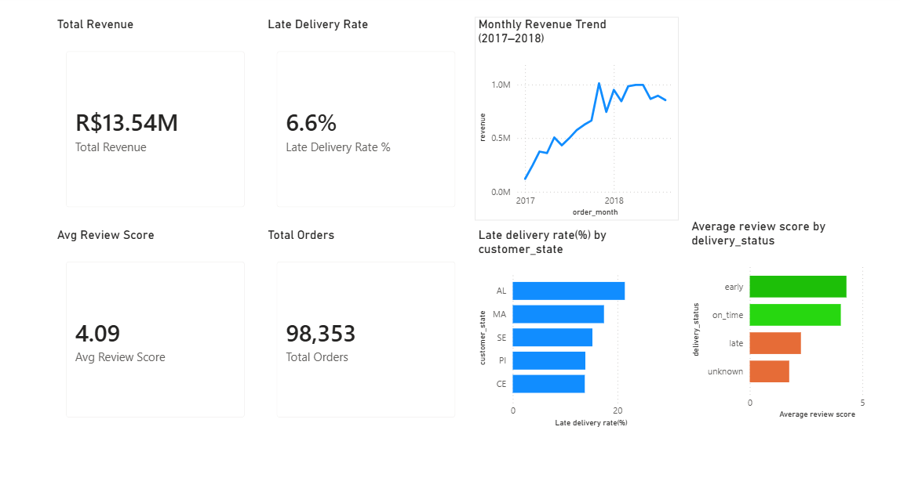

# Olist E-Commerce Business Intelligence Project

An end-to-end data analytics project on Olist's Brazilian e-commerce marketplace data — from raw 
CSVs to a cleaned PostgreSQL database, SQL analysis, and a Power BI dashboard.

## What's in this project

- Data cleaning and quality checks on ~100k real e-commerce orders (2016–2018)
- A relational PostgreSQL database built from the cleaned data
- SQL views for business analysis (revenue, delivery, customer experience, sellers)
- Python notebooks for exploratory analysis and feature engineering
- A 5-page Power BI dashboard

## Tools

Python (pandas, SQLAlchemy) · PostgreSQL · SQL · Power BI

## Dataset

[Brazilian E-Commerce Public Dataset by Olist](https://www.kaggle.com/datasets/olistbr/brazilian-ecommerce), 
via Kaggle. Raw and processed CSVs aren't tracked in this repo — download the dataset from Kaggle 
and place it in `data/raw/` to reproduce the notebooks.

## Project structure
olist-ecommerce-business-intelligence/
│
├── data/
│ ├── raw/ # original CSVs (not tracked)
│ └── processed/ # cleaned CSVs (not tracked, regenerated by notebooks)
│
├── notebooks/
│ ├── 01_data_audit.ipynb
│ ├── 02_data_cleaning.ipynb
│ ├── 03_load_to_postgres.ipynb
│ ├── 04_feature_engineering.ipynb
│ └── 05_exploratory_data_analysis.ipynb
│
├── sql/
│ ├── query/ # database schema
│ └── schema/ # analytical views
│
├── powerbi/
│ ├── olist_ecommerce_viz.pbix
│ └── assets/ # dashboard screenshots
│
├── docs/
│ ├── data_quality_report.md
│ ├── cleaning_log.md
│ └── eda_findings.md
│
├── README.md
├── requirements.txt
└── .gitignore

## How to run this

1. Download the dataset from Kaggle and place the CSVs in `data/raw/`
2. Create a `.env` file with your PostgreSQL password (`DB_PASSWORD=...`)
3. Run the notebooks in order (01 → 05)
4. Open `powerbi/olist_ecommerce_viz.pbix` in Power BI Desktop, pointed at your local database

## Documentation

- [`docs/data_quality_report.md`](docs/data_quality_report.md) — findings from the initial audit
- [`docs/cleaning_log.md`](docs/cleaning_log.md) — cleaning decisions and reasoning
- [`docs/eda_findings.md`](docs/eda_findings.md) — exploratory analysis results

## Dashboard preview

Full dashboard covers Executive Overview, Revenue & Growth, Delivery & Operations, Customer 
Experience, and Seller Performance. See `powerbi/assets/` for all page screenshots.

## Status

Complete: data audit, cleaning, database, feature engineering, EDA, SQL analysis, and dashboard.